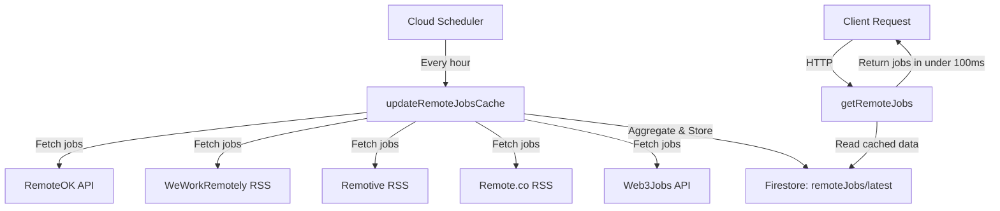

# Remote Jobs Serverless - Caching & Scheduling Architecture Plan

## Overview

This document outlines the architecture for optimizing the remote jobs aggregation system by implementing Firestore caching and scheduled updates.

## Current Problem

The getRemoteJobs HTTP Cloud Function is slow because it:
- Fetches data from 5 different sources (RemoteOK, WeWorkRemotely, Remotive, Remote.co, Web3Jobs)
- Makes multiple API calls and RSS feed requests with retry logic
- Processes and aggregates 100-500 jobs on every client request
- Can take 10-30+ seconds to complete

## Proposed Solution

Implement a two-function architecture:

1. **Scheduled Function** (updateRemoteJobsCache) - Runs every hour
2. **HTTP Function** (getRemoteJobs) - Modified to read from Firestore cache

## Architecture Diagram

## Firestore Data Structure

### Collection: remoteJobs

#### Document: latest

The document will contain a jobs array and metadata about the cache:

- jobs: Array of job objects with all the existing fields
- metadata: Object containing lastUpdated timestamp, jobCount, source statistics, and update duration

## Implementation Details

### 1. Scheduled Function: updateRemoteJobsCache

**Purpose**: Fetch jobs from all sources and update Firestore cache

**Configuration**:
- Schedule: every 1 hours (Cloud Scheduler cron syntax)
- Timeout: 540 seconds (9 minutes - max for scheduled functions)
- Memory: 512MB (increased for handling large datasets)

**Implementation Steps**:
1. Reuse existing fetch functions (no changes needed)
2. Aggregate jobs using existing logic
3. Store results in Firestore document remoteJobs/latest
4. Track metadata (timestamp, counts, errors)
5. Log execution details for monitoring

**Error Handling**:
- Individual source failures won't stop the update
- Partial data is acceptable (better than no cache)
- Log all errors for debugging

### 2. Modified HTTP Function: getRemoteJobs

**Purpose**: Serve cached job data to clients

**Changes**:
1. Remove all fetching logic
2. Read from Firestore remoteJobs/latest document
3. Return cached jobs array immediately
4. Add cache metadata to response headers

**Performance**:
- Response time: < 100ms (vs 10-30+ seconds)
- Firestore read: 1 document read per request
- Cost reduction: 99% fewer API calls

### 3. Fallback Mechanism

If Firestore read fails:
1. Log error
2. Return cached error response with helpful message
3. Optionally: Fall back to live fetching (configurable)

## Configuration Changes

### firebase.json

Will need to add Firestore configuration for security rules and indexes.

### Firestore Security Rules

The remoteJobs collection should allow public read access but only Cloud Functions can write.

## Deployment Strategy

### Phase 1: Create New Functions
1. Add updateRemoteJobsCache scheduled function
2. Deploy and test the scheduled function
3. Verify Firestore updates are working

### Phase 2: Modify Existing Function
1. Update getRemoteJobs to read from cache
2. Deploy updated function
3. Test response times

### Phase 3: Monitoring
1. Monitor Cloud Function logs
2. Check Firestore usage
3. Verify hourly updates are occurring

## Benefits

### Performance
- **Response Time**: 10-30s → < 100ms (99%+ improvement)
- **User Experience**: Near-instant job listing loads
- **Scalability**: Can handle 1000s of concurrent requests

### Cost Optimization
- **API Calls**: Reduced by 99% (only hourly scheduled runs)
- **Function Invocations**: Same number of HTTP requests, but much shorter execution time
- **Firestore**: 24 writes/day + reads (very cost-effective)

### Reliability
- **Availability**: Jobs available even if sources are temporarily down
- **Consistency**: All clients get the same data set
- **Error Isolation**: Source failures don't impact client requests

## Cost Estimation

### Before (Per 1000 Requests)
- Cloud Functions: 1000 invocations × 20s avg = 20,000s execution time
- External API calls: 1000 × 5 sources = 5,000 API calls
- Estimated cost: $0.50-1.00 per 1000 requests

### After (Per 1000 Requests)
- Cloud Functions: 1000 invocations × 0.1s = 100s execution time
- Firestore reads: 1000 reads
- Scheduled function: 24 runs/day × 30s = 720s/day
- Estimated cost: $0.05-0.10 per 1000 requests

**Savings**: 90% cost reduction

## Testing Plan

### Local Testing with Emulators

Start Firebase emulators and test both the scheduled function and HTTP function locally.

### Production Testing
1. Deploy scheduled function
2. Manually trigger via Cloud Console
3. Verify Firestore document created
4. Deploy HTTP function
5. Test client requests
6. Monitor logs for 24 hours

## Monitoring & Maintenance

### Key Metrics to Track
- Scheduled function execution time
- Scheduled function success/failure rate
- Number of jobs cached per update
- HTTP function response time
- Firestore read/write operations
- Source-specific error rates

### Alerting
Set up alerts for:
- Scheduled function failures (> 2 consecutive failures)
- Cache age > 90 minutes (missed update)
- Job count drops significantly (< 50% of average)

## Future Enhancements

1. **Multiple cache versions**: Store hourly snapshots for historical data
2. **Job deduplication**: Track seen jobs across updates to identify new postings
3. **Search indexing**: Add Algolia or similar for advanced search
4. **Source prioritization**: Weight sources based on quality/reliability
5. **Real-time updates**: Trigger cache updates when individual sources publish new jobs
6. **Analytics**: Track popular jobs, click-through rates, etc.

## Rollback Plan

If issues arise:
1. Revert getRemoteJobs to original implementation
2. Disable scheduled function
3. Delete Firestore cache documents
4. Investigate issues before re-deploying

## Questions Addressed

✅ How to store results in Firebase: Single document in remoteJobs/latest collection

✅ How to configure hourly updates: Cloud Scheduler with every 1 hours schedule

✅ Fast client response: Read from Firestore cache (< 100ms vs 10-30s)

✅ Backward compatibility: Keep existing function name, modify implementation

✅ Data structure: Single document with jobs array + metadata

## Implementation Checklist

- [ ] Create updateRemoteJobsCache scheduled function
- [ ] Implement Firestore write logic with metadata tracking
- [ ] Modify getRemoteJobs to read from Firestore
- [ ] Add error handling and fallback mechanisms
- [ ] Create Firestore security rules file
- [ ] Update firebase.json configuration
- [ ] Test with Firebase emulators
- [ ] Deploy to production
- [ ] Monitor first 24 hours
- [ ] Document deployment process

## Next Steps

Ready to implement? Switch to Code mode to begin creating the new functions and modifying the existing one.